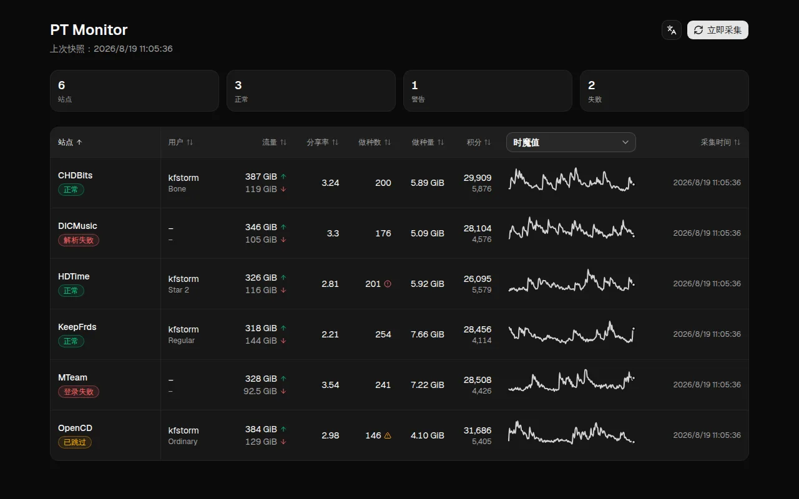

# PT Monitor

自托管 PT 账号状态仪表盘：复用 Prowlarr 的登录 Cookie 与 PT-depiler 的站点解析，自动采集各站账号的上传/下载/分享率/魔力/做种/H&R 状态，以 Web 面板与趋势图展示，历史存入内置 SQLite。

## 和 PT-depiler 的区别

PT-depiler 是浏览器插件，负责在浏览网页时帮你搜索种子、批量下载、联动下载器等。PT Monitor 不包含这些高级功能，只专注一件事：把各 PT 站的账号数据（上传、下载、分享率、魔力等）采集起来，做成随时能看的仪表盘。

它复用 PT-depiler 的站点解析代码，但不是 PT-depiler 的分支或替代品。

因为 PT Monitor 可以部署在 NAS 或服务器上，用手机、平板等任何设备打开网页就能查看数据；而 PT-depiler 必须在电脑浏览器里装插件、保持登录才能看到。



## 目录

- [特性](#特性)
- [Docker 快速开始](#docker-快速开始)
- [从源码运行](#从源码运行)
- [FlareSolverr](#flaresolverr)
- [安全](#安全)
- [开发](#开发)
- [License](#license)

## 特性

- **复用 Prowlarr 凭据:** 直接从 Prowlarr 数据库读取 Cookie / Token，不重复维护账号
- **站点差异交给 PT-depiler:** 内置 NexusPHP / Gazelle / Unit3D 等解析器，覆盖主流 PT 站
- **Web 面板 + 趋势图:** 当前状态总览与 7 天可切换指标趋势，单进程单端口
- **内置历史:** SQLite 快照，无需 Prometheus / Grafana
- **隐私安全:** 日志、API、快照、错误信息都不包含 Cookie / passkey 值

## Docker 快速开始

在源码目录构建镜像并运行：

```bash
docker build -t pt-monitor .
docker run -d \
  --name pt-monitor \
  -p 9709:9709 \
  -v /srv/prowlarr/config:/prowlarr:ro \
  -v /srv/pt-monitor/data:/app/data \
  -e PROWLARR_DB=/prowlarr/prowlarr.db \
  pt-monitor
```

打开 <http://127.0.0.1:9709> 。首次启动立即采集一次，之后默认每 30 分钟采集。

### 环境变量

| 变量 | 默认值 | 说明 |
| ------ | -------- | ------ |
| `PROWLARR_DB` | `/prowlarr/prowlarr.db` | Prowlarr 数据库路径 |
| `STATE_DB` | `/app/data/pt-monitor.db` | 历史 SQLite |
| `SITES` | （自动发现） | PT-depiler definition 列表，逗号分隔 |
| `LISTEN` | `0.0.0.0` | 监听地址 |
| `PORT` | `9709` | 端口 |
| `INTERVAL_MINUTES` | `30` | 采集间隔（分钟） |
| `TIMEOUT_MS` | `30000` | HTTP 超时 |
| `USER_AGENT` | — | 自定义 User-Agent |
| `FLARESOLVERR_URL` | — | 启用 FlareSolverr 回退 |
| `FLARESOLVERR_TIMEOUT_MS` | `90000` | FlareSolverr 超时 |
| `DEBUG` | — | 设 `1` 或 `true` 开启调试日志 |

也可在 `docker run` 末尾追加 CLI 参数覆盖任何配置。

## 从源码运行

需要 Node.js ≥ 24、pnpm 10（`corepack enable`），以及 curl/tar（bootstrap 下载 vendor 用）。

```bash
corepack enable
pnpm install
pnpm bootstrap   # 拉取固定版本的 PT-depiler 并应用 Node overlay
pnpm ui:build    # 构建前端到 frontend/dist，本地运行前需要执行一次
pnpm cli serve \
  --db /srv/prowlarr/prowlarr.db \
  --sites <definition1,definition2>
```

默认监听 `127.0.0.1:9709`。不传 `--sites` 时尝试自动发现 Prowlarr 与 PT-depiler 的交集；自动发现只做保守匹配，名称不一致的站建议显式传 `--sites`。完整 CLI 参数见 `pnpm cli --help`。

`definition` 是 PT-depiler 内置的站点定义名（如 `hdtime`），对应其 [definitions 目录](https://github.com/pt-plugins/PT-depiler/tree/master/src/packages/site/definitions)下的文件名（去掉 `.ts` 后缀）。要查看有哪些可用站点，直接在该目录里查找即可。

常用命令：

```bash
pnpm cli list --db /srv/prowlarr/prowlarr.db --all   # 查看 indexer、Cookie 名称与过期时间
pnpm cli fetch <definition> --db /srv/prowlarr/prowlarr.db # 单站采集（不写历史）
pnpm cli doctor --db /srv/prowlarr/prowlarr.db       # 检查运行环境
```

## FlareSolverr

部分站点启用 Cloudflare 防护，可启动 FlareSolverr 并配置回退：

```bash
pnpm cli serve \
  --db /srv/prowlarr/prowlarr.db \
  --sites <definition1,definition2> \
  --flaresolverr-url http://127.0.0.1:8191/v1
```

Docker 下用 `FLARESOLVERR_URL` 环境变量。FlareSolverr 拿到的 Cookie 只在进程内存中使用，不写回 Prowlarr。

## 安全

- 本工具直接读取你的登录凭据：Prowlarr app-data 请以只读方式挂载，不要将 `prowlarr.db`、Cookie 或 passkey 提交到 Git，也不要把登录后的页面 HTML 上传到公开问题。
- Web 面板没有登录认证，且 Docker 镜像默认监听 `0.0.0.0`。不要直接暴露到公网；需要远程访问时，请通过反向代理叠加认证。
- 日志、CLI 输出、Web API 与错误信息都不包含 Cookie / passkey 值。

## 开发

```bash
scripts/check-backend.sh       # 后端类型检查
scripts/check-frontend.sh      # 前端格式、lint、typecheck 与构建
scripts/check-markdown.sh      # 文档规范检查
scripts/test.sh                # 后端 tsx 测试 + 前端 Vitest
scripts/check-duplication.sh   # jscpd 重复代码检查（阈值 0）

pnpm ui:build                  # 构建前端到 frontend/dist（本地运行前端前执行一次）
pnpm ui:dev                    # Vite dev server，/api 代理到 127.0.0.1:9709
```

### 前端开发用 mock 数据

不启动真实后端（`pnpm cli serve`）也能开发前端：mock 服务器模拟后端的 `/api` 接口，返回确定性的假数据（每站按固定种子生成随机游走，累计量带偶发峰值和抖动，趋势迷你图像真实采集数据且可复现）。

```bash
pnpm mock:server   # 监听 127.0.0.1:9709，替代真实后端
pnpm ui:dev        # Vite dev server，/api 代理到 127.0.0.1:9709
```

打开 <http://127.0.0.1:5173> 即可。用 `PORT` / `HOST` 环境变量可改监听地址。

更新 README 顶部的 `docs/screenshot.webp`（启动 mock 与 dev server 后，用浏览器打开界面截图，再转成 WebP）：

```bash
agent-browser open http://127.0.0.1:5173
agent-browser screenshot shot.png
convert shot.png -quality 82 docs/screenshot.webp
```

`pre-commit run --all-files` 会跑上述全部检查；PR 的 CI 执行同一套，另外构建多架构 Docker 镜像。先 `pre-commit install` 让每次 `git commit` 自动对暂存文件执行这些检查。

- `vendor/PT-depiler` 由 `pnpm bootstrap` 按固定 commit 拉取并应用 Node 兼容 overlay，vendor 更新后重新运行 bootstrap。
- 采集结果存入 SQLite `snapshots` 表（保留原始 PT-depiler JSON），不存 Cookie。

## License

MIT。`vendor/PT-depiler` 按上游 MIT 许可证使用。
